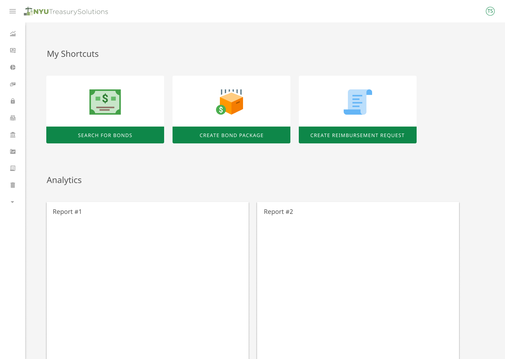

NYU projects that were development inside the school's OTSS (Operations Technology Service and Support). 

<!-- end -->

## About the projects 

These are some of the collections I have made at my time at NYU. I was responsible for mainly UX/UI designs for NYU platforms. Most of the projects were created for NYU specifically. I was in charge of executing all visual design stages from concept to final hand-off for the development team. I created wire-frames, mock-ups, storyboards, user flows, process flows and site maps to effectively communicate interaction and design ideas. Established, promoted, and followed design guidelines, best practices, and standards for each project. Currently developing design templates in Sketch, and React.js for development and design teams. Assisting in Q and A testing for development on accessibility function for NYU websites.

## Current Projects

### Work-link NYU 2019

This is a platform that the school will use to submit and respond to building maintenance service facilities regarding safety, repair and damage control across the entire campus of NYU. Currently working with the development team in creating React components using Redux and Typescript. Front end development on React and Redux states for desktop and mobile environments.

### Treasury NYU 2018

Created templates in sketch and React for design and development teams. I worked closely with the development team in creating React and Redux components converting designs into functional code. I also assisted in Q and A testing for development of accesibility codes for newly developing NYU websites. 

[Link to a prototype!](https://codesandbox.io/embed/kxoqlkqoo)

[Here is a link to my google drive](https://drive.google.com/drive/u/2/folders/1wOZ-LgxUQcs7VEJXXP810o2BROShSMaf)
