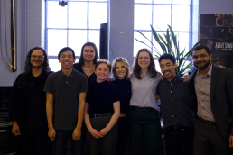

This project was part of Pratt Institute's own development of a mobile app. The app was designed to be a virtual tour guide for an event that would showcase all of Pratt's research in science and design. 


<!-- end -->

## About the project

When a guest arrives at Pratt on March 30th for the Research Open House event, they will be able to utilize this app to navigate to various research projects and presentations stationed around campus. The user is able to view a list of departments, buildings, presenters, and research projects, select from this list and be presented with a “follow the yellow brick road” navigation to the chosen project, view listed information about the projects within each building when clicked, and view the day’s schedule of events. 

### Stages of the project

*   Pre-development
*   Development
*   Implementation

### Pre-Development 

This involved the design mockups of the app and designing the user interface. The platform of the app will also be decided in this stage, as well as what platforms the app will be exported to. In this stage, the team will be running necessary tests to formulate the app, such as creating test files of different aspects of the app. This begins with developing certain essential elements - location awareness - and also goes into testing elements that will ease the user’s experience, like radar mapping and design of the menus. Another important aspect in the pre-development stage is putting out tests onto the projected platform, which has already begun with development in ARKit and ARCore.

#### Development 

Building specific map- This map is activated when entered through the building-specific GUI pop-up, through the building selection menu, or the student union button on the food blurb. (Unity project: assets/scenes/DesignCenter). 

(Insert mockups here)

1. Connects the user’s icon to the chosen building with a walking path. 
2. Screen loads with the building specific GUI pop-up activated.
3. General menu button remains at the top.
4. Above the menu button is a line of text with the name of the selected building. 
5. There is a button that returns the user to the main map.
6. Once the user physically arrives in the location, the GUI pop-up listing the building’s project information is automatically re-activated. 

(Unity pictures here)


##### Implementation 

 In this stage, the locations for the AR simulations will be finalized, as well as development of the app on the AR devices. The rest of this stage will be spent debugging and running alpha and beta tests. The end product that will be produced will be an app that is aware of the user’s location and that can follow a specified tour path (ex. Rockstar tour), and that also has augmented reality capabilities that are based on the tour and historical spots in Pratt. It will have an overall map that shows where all the hot spots are and a summary of what’s in the hotspot area with a picture or animation. The ultimate end goal is to have the app finished by March 1st, 2019. This will be achieved with the timeline of finishing the app’s alpha test on February 15th, to allow for half a month of polishing. The pre-development stage will be done by the end of the fall semester, and then the team can transition into development stage, which will end in mid- to late- January. The implementation stage should begin on January 16th. 


```javascript
$(document).ready(function() {
    console.log('More jQuery, wow!')
})
```

###### ras aliquet ipsum ut enim pellentesque, id varius quam placerat

Maecenas non scelerisque leo. Sed id purus fringilla, consequat magna non, faucibus neque. Cras ornare nisi a lectus ultricies convallis. Integer tristique dictum eros, et elementum ante consectetur eget. Phasellus sollicitudin est vestibulum suscipit pellentesque. Duis in eros cursus magna laoreet aliquam vel a lectus. Nulla ut nisi vitae ipsum sollicitudin vestibulum. Aenean sit amet mattis odio. Vestibulum ultrices sed ipsum nec pretium. Integer non turpis nunc. Praesent tincidunt tincidunt alique

Integer mollis dolor non libero placerat, ut efficitur nisi ultricies. Etiam ac lacinia urna, eget ornare nunc. Suspendisse eget eros id turpis gravida semper. Duis ornare lorem et est pellentesque, quis rhoncus leo vestibulum. Nullam eu nulla ut elit rutrum iaculis. Cras a laoreet elit, in aliquet erat. Sed interdum varius posuere. Pellentesque eget luctus erat. Nam quis sem in ligula efficitur bibendum.