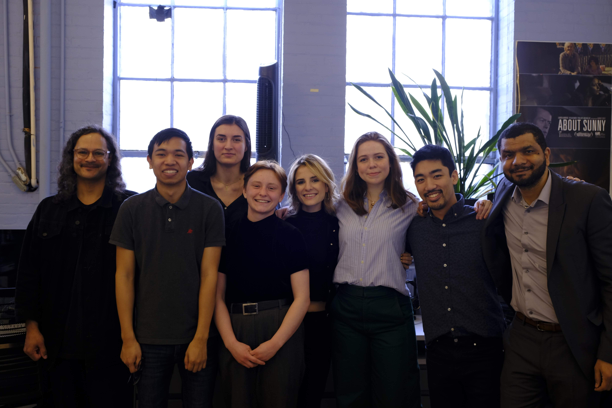
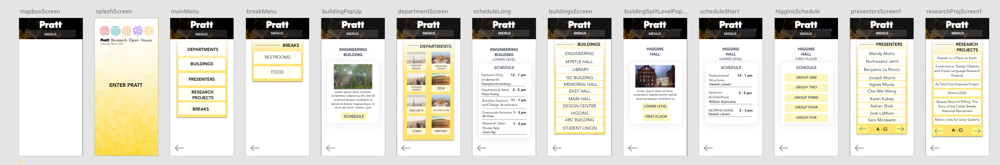

This project was part of Pratt Institute's own development of a mobile app. The app was designed to be a virtual tour guide for an event that would showcase all of Pratt's research in science and design.



<!-- end -->

# About the project

When a guest arrives at Pratt on March 30th for the Research Open House event, they will be able to utilize this app to navigate to various research projects and presentations stationed around campus. The user is able to view a list of departments, buildings, presenters, and research projects, select from this list and be presented with a “follow the yellow brick road” navigation to the chosen project, view listed information about the projects within each building when clicked, and view the day’s schedule of events.

[Watch the video!](https://www.youtube.com/watch?v=jKz7ENGhmCE&feature=youtu.be)

## Stages of the project

*   Pre-development
*   Development
*   Implementation

## Pre-Development

This involved the design mockups of the app and designing the user interface. The platform of the app will also be decided in this stage, as well as what platforms the app will be exported to. In this stage, the team will be running necessary tests to formulate the app, such as creating test files of different aspects of the app. This begins with developing certain essential elements - location awareness - and also goes into testing elements that will ease the user’s experience, like radar mapping and design of the menus. Another important aspect in the pre-development stage is putting out tests onto the projected platform, which has already begun with development in ARKit and ARCore.

## Development

Building specific map- This map is activated when entered through the building-specific GUI pop-up, through the building selection menu, or the student union button on the food blurb. (Unity project: assets/scenes/DesignCenter). 

(Insert mockups here)

1. Connects the user’s icon to the chosen building with a walking path. 
2. Screen loads with the building specific GUI pop-up activated.
3. General menu button remains at the top.
4. Above the menu button is a line of text with the name of the selected building. 
5. There is a button that returns the user to the main map.
6. Once the user physically arrives in the location, the GUI pop-up listing the building’s project information is automatically re-activated.



## Implementation

 In this stage, the locations for the AR simulations will be finalized, as well as development of the app on the AR devices. The rest of this stage will be spent debugging and running alpha and beta tests. The end product that will be produced will be an app that is aware of the user’s location and that can follow a specified tour path (ex. Rockstar tour), and that also has augmented reality capabilities that are based on the tour and historical spots in Pratt. It will have an overall map that shows where all the hot spots are and a summary of what’s in the hotspot area with a picture or animation. The ultimate end goal is to have the app finished by March 1st, 2019. This will be achieved with the timeline of finishing the app’s alpha test on February 15th, to allow for half a month of polishing. The pre-development stage will be done by the end of the fall semester, and then the team can transition into development stage, which will end in mid- to late- January. The implementation stage should begin on January 16th.


```javascript
$(document).ready(function() {
    console.log('More jQuery, wow!')
})
```

# Overall features of the app

## Screen-by-screen specification
Splash screen- Includes the Pratt Research Open House logo on black. (Unity project: assets/scenes/Screen1) 

## Main map

After the splash screen, the user will see a full map of the school with a functional zoom slider and an icon showing their location. (Unity project: assets/scenes/Screen2) 
At this time, all of the buildings should be present as individual mapbox tileset map layers. When the user clicks on a building, a building specific GUI pop-up will appear.
The building specific GUI pop-up can be exited through a corner button.
There is a general menu accessible through a button at the top of the screen.

## Building specific GUI pop-up

This pop-up is activated when a building is tapped from the main map screen. (GameObject: GUI -> InfoPopUp_1; using PopUp.cs)
Populated with information from an externally hosted JSON file listing the projects within the building, their room numbers, presenter names, and project description. 
This pop-up can be closed by tapping an exit button. 
There is an option on the pop-up to “go to this building,” changing the scene to the corresponding building-specific map. 

## General menu 

At the top center of the screen, there is a menu button. When pressed, the menu reveals the following options: 
“Research topics” menu
“Locations” button connecting to the main map
“Schedule” button 
“Food” button

## “Research topics” menu

This menu will display the categories of research topics as various clickable buttons.
The research categories will be retrieved as an array of strings from the JSON file and used to populate the buttons in this menu. 
When clicked, each category will lead to the Category specific menu of research projects.
There is additionally a back button.

## Category specific menu of research projects

Accessed from the “Research topics” menu. This menu presents all projects from the selected category as clickable buttons. 
These buttons link to the building specific maps for each of the projects’ locations.
List of research projects under each category pulled from external file.

## “Schedule”

Pulls up a list of the day’s schedule, pulled from the JSON file.
Time, location, and event name.
Includes a back button.

## “Food” Presents the blurb of food information from the external file.

Includes a button to “go to the student union,” which pulls up the student union version of the building specific map.
Includes a back button.

## Building specific map

This map is activated when entered through the building-specific GUI pop-up, through the building selection menu, or the student union button on the food blurb. (Unity project: assets/scenes/DesignCenter)
Connects the user’s icon to the chosen building with a walking path. 
Screen loads with the building specific GUI pop-up activated.
General menu button remains at the top.
Above the menu button is a line of text with the name of the selected building. 
There is a button that returns the user to the main map.
Once the user physically arrives in the location, the GUI pop-up listing the building’s project information is automatically re-activated. 

## Outstanding Goals

Determining what arrays of information will be transferred between Unity and JSON.
Creating this JSON file with all the information and using it to populate various aspects of the UI.
Use the mapbox replace feature modifier to put the accurate campus .obj files on the map.
Begin playtesting with the location services we currently have.
Define the export workflow.
