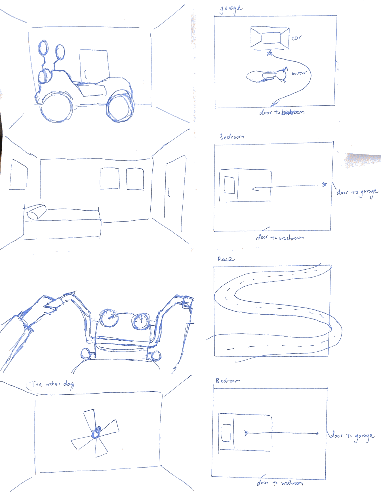

This is a collection of my work in VR and AR. Most of these projects were developed in-class assignments and some for side projects as well. 

<!-- end -->

<!-- Project on VR dream racer -->
This is a first-person VR experience that will revolve around telling the story of how an older person dreams about riding their old motorcycle again. The experience is meant to tell a simple story of feeling old and wishing for youthful experiences again. The player will get to experience two periods in time. The past and present. In the present, the player will see and feel what it is like to live a mundane life through the eyes of an older character. The story will be a short experience that touches on a little bit of magic in the end. There will be two Try on the headset to go through the story of an old character experiencing their old motorcycle again. This porject was developed with two other students from NYU.

We created the experience using Unreal engine and Maya modeling/animation techniques. We also did a number of audio recordings and music compostion for narration and background music. 


<!--Picture of things-->
This was one of our first concepts in creating the experience.

#Script
>Dream Racer

>Treatment, 04/05/19

>Steven Yoo, Grant Ng and Chenchen Zhou

>Logline

>First person VR experience that will revolve around telling the story of how an older person dreams about riding their old motorcycle again. The experience is meant to tell a simple story of feeling old and wishing for youthful experiences again. The player will get to experience two periods in time. The past and present. In the present, the player will see and feel what it is like to live a mundane life through the eyes of an older character. The story will be a short experience that touches on a little bit of magic in the end. There will be two Try on the headset to go through the story of an old character experiencing their old motorcycle again.

>Character

>An elderly man/ player – He is a really old man who always has a dream of becoming a motorbike racer since he was young but didn’t achieved that. There is a broken motorbike in his garage for a really long time but he didn’t have time to repair it since he has to do the work. Now he is old with physical disabilities which also makes him unable to ride on the motorbike.

>Script

>BATHROOM

>An old person wakes up in front of the mirror. The player will see that they are an older person. Once the player looks at the bathroom door, a text will show up and say “go to the bedroom”.

>[teleport, fade to black]

>BEDROOM

>The bedroom will have a bunch of motorcycle posters and memorabilia.

>And then another door will lead to the garage, with the text on a hover over that will say “go to the garage”.  

>[teleport, fade to black]

>GARAGE

>When the player is in the garage, they will see a motorcycle that is either broken or too old to ride. Then the player will be prompted to go to the car. Once the player is at the car, the player will be transported to the work setting.

>[teleport, fade to black]

>WORK

>The player will be super slow and have mundane (repetitive, simple puzzles) tasks. Will only last for like a minute or so. The player will then be prompted to leave through a door with a hover over “go home”.

>[teleport, fade to black]

>GARAGE

>The player will be transported back to the garage and see the old bike again.

>[teleport, fade to black]

>BEDROOM

>Prompt the player to go to sleep. Once the screen fades to black.

>[teleport, fade to black]

>DREAM (race)

>The dream will start out on a motorcycle race track. The track will be interactive where the player can control the speed and direction of the motorcycle. After a certain amount of time the player will see that the motorcycle will stop working and smoke will be coming out. The player looks at the motorbike and then fades to black.

>[teleport, fade to black]

>BEDROOM

>The player wakes up back in the bedroom the morning after. And the player is prompted to go to the garage door with the same “go to the garage” text.

>[teleport, fade to black]

>GARAGE

>Once the player goes to the garage, the player will see the brand new bike like from the dream, and the story ends.

>This was our rough script concept after three rough drafts, we decided to go with a more simplified story for our project. We originally wanted to create a story that revolved around the concept of religion and to live live are determined by individual choices we make for specific scenarios. 

#Mood Board

The team and I wanted to create a low poly type of style to the experience. We were only given about a month to do this project. We thought that having a low style will look aesthetically pleasing and would require less rendering for faster prototyping. 

Our first sketch detailing the general idea of how the player will interact with their surroundings and objects.
  

<!-- The imgur link needs to end in .png!!!!-->
#First Prototype
[](https://youtu.be/bwQ_m6H9wWE)
We used the Unreal project settings for a third person game which still works in a VR headset. We eventually changed the way the player will move in the world. We wanted to get our models and objects in a space first and see if they are rendered correctly. This was testing to see if the office scene would work. 


<!-- end of dream racer -->

Fusce at pharetra diam. Sed eget erat nibh. Nulla condimentum eros a nisi placerat, nec ultrices arcu dictum. Vestibulum nec elementum mi, id tempor ligula. Etiam ut lectus ac quam facilisis sodales. Donec laoreet justo id diam aliquet aliquet. Vivamus arcu est, varius in erat non, pharetra pulvinar magna. Fusce quis elementum nulla.

Nullam tristique ante quis gravida aliquet. Donec elementum, leo eu interdum mattis, erat quam vestibulum nunc, nec convallis eros risus ut enim. Sed maximus odio tincidunt velit congue molestie. Nunc in pharetra eros, id pulvinar justo. Pellentesque quis accumsan leo. Praesent efficitur magna a posuere viverra. Morbi sit amet tincidunt mauris. Vestibulum sed maximus felis. Proin in tellus eu nisi dictum posuere eu id felis. Donec eget mi sit amet neque efficitur suscipit ut ut neque. Vivamus egestas, augue vitae vestibulum feugiat, lorem elit lobortis nulla, eget ornare arcu ipsum ac lacus. Proin a suscipit ligula, non facilisis nibh. Nunc et eros magna.

>Aenean quis nisi eros. Praesent a libero et ante sagittis dictum eget id ipsum. Duis sit amet bibendum justo. Morbi faucibus vehicula bibendum. Praesent ornare hendrerit commodo. Praesent sit amet nisi mauris. Aenean maximus pharetra lacinia. Praesent efficitur erat id dolor laoreet rhoncus. Cras eu efficitur arcu. Nunc pretium, nunc sit amet rutrum molestie, arcu nisi tempus ligula, eu dapibus leo tortor in quam.

Vivamus viverra id ipsum nec hendrerit. Fusce mollis enim et ultricies varius. Nam at dictum augue, id dictum augue. Fusce laoreet purus id iaculis cursus. Donec non velit est. Integer pellentesque viverra sapien, id rhoncus ipsum dictum ac. Aliquam vel maximus tortor, vitae interdum turpis. Etiam egestas elementum massa, id dictum magna suscipit vel. Curabitur mi tellus, pharetra eget nisi vitae, blandit vulputate nibh. Aenean tincidunt purus eu feugiat pulvinar. Maecenas quis laoreet lorem, a molestie urna. Cras iaculis justo elit, nec venenatis ante sollicitudin a. Cras eu pellentesque arcu, sit amet auctor felis.

```javascript
$(document).ready(function() {
    console.log('Welcome!');
})
```

Curabitur non blandit dui. Maecenas in ipsum nec leo pellentesque sodales et nec quam. Ut ut facilisis metus, sit amet aliquam nibh. Quisque blandit dui quis augue dictum vehicula.
